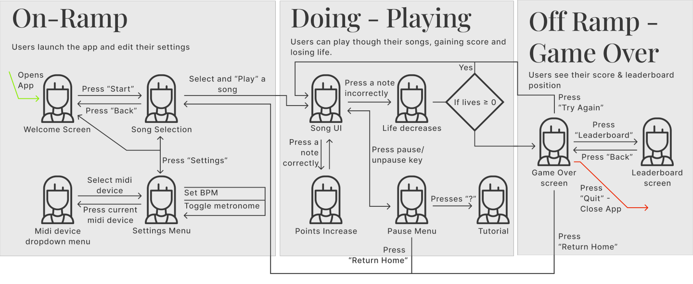

# Melodify — An Emotive Musical Decision Tree
## Project Overview
Melodify is an application designed to enhance midi instrument practice and improvisation through the
guidance of a midi-based decision tree. The project aims to transform these activities through ‘guided
improvisation’ where a player is given the opportunity and encouraged to experiment with alternative
harmonies and melodies as they perform a piece. Conceptually, the project can be described as a “choose
your own adventure”-type interface, where notes played on the input instrument influence the direction of
musical development.

Built using **Python, Pygame, and MIDI**, Melodify supports beginner to intermediate players, blending **music theory, gamification, UX principles, and immersive audio** into a dynamic experience.

---

## UX Journey

Melodify was built around **Human-Computer Interaction (HCI)** and **Flow Theory**. Some UX highlights:
Melodify is designed to provide users with the most realistic and fun experience to learn piano quickly. That
is why it receives inputs from a real keyboard, which is connected to the laptop externally, through a USB or
MIDI cable. The app supports various kinds of keyboards, ranging from large e-pianos to small MIDI pianos.

<table>
  <tr>
    <td align="center"><b>Flowchart of User Experience Journey</b></td>
  </tr>
  <tr>
    <td></td>
  </tr>
</table>

Thanks to the intuitive design of the interface, the user experience is straightforward. After plugging the
keyboard into a computer, users open Melodify app. The application automatically detects the keyboard and
connects it. If many keyboards are connected, users can select the desired one on “Setting” page by pressing
“Settings” button. To begin the learning journey, users press the “Start” button, then choose a song to learn
and press the “Play” button to start the game.

<table>
  <tr>
    <td align="center"><b> Notes falling from the top of screen</b></td>
    <td align="center"><b> Users choose either of 2 branches</b></td>
  </tr>
  <tr>
    <td>
      
    </td>
    <td>
      
    </td>
  </tr>
</table>

Once the game begins, the notes (dots) are displayed and they fall from the top down vertically. There is a
virtual keyboard layout at the bottom of the app, which represents the keys on the user’s keyboard. Whenever
users press any keys on their physical keyboards, the corresponding keys on the virtual keyboard in the app
will be shaded, giving users an intuitive experience. Therefore, users can adapt quickly and self-correct easily
when pressing the wrong keys

Sometimes the application displays 2 series of notes (2 branches) with 2 different colours, users need to choose
a path by pressing a note associated with their preferred branch. The falling notes gradually go down until
they reach the green bar, right above the virtual keyboard, which indicates the perfect time for users to press
the corresponding keys.

<table>
  <tr>
    <td align="center"><b>User hits the right key</b></td>
    <td align="center"><b>User hits the wrong key</b></td>
  </tr>
  <tr>
    <td>
      
    </td>
    <td>
      
    </td>
  </tr>
</table>

Whenever the users press the correct keys at the right time, the virtual keyboard turns green to celebrate
that success, and the score is increased. On the other hand, when they press the wrong keys, or press at the
wrong time, the virtual keyboard turns red and the health bar (life) is deducted.
During the game, users can press “P” key to pause the game. On the Pause Menu page, users can access
the game tutorial by pressing “?” key, and pressing it again to exit the tutorial.
As the players progress, the game gradually enhances the difficulty level. More notes of the song are
displayed, which makes the users play quicker, therefore, the piano sound becomes more beautiful and
complex. As the game progresses, the system plays more well-composed background music tracks. That
means the longer the players play, the more beautiful music they produce. Therefore, this mechanism makes the game sticky to the players, and the more they practice playing piano, the better they become.
When users make mistakes, such as pressing the wrong keys or pressing the correct key at the wrong time,
the health bar is deducted. The game ends when the health bar is empty, and then users go to the “Game
Over” page. On this page, users can check their rankings by clicking “Leaderboard” button, play again by
pressing the “Play Again” button or they can stop the game by choosing the “Quit” button.
After experiencing the game, we want the users to feel playing piano is not as difficult as they thought, it’s
not boring and time-consuming like what people say. They can play their favourite songs and enjoy
beautiful rhythms on the first several tries. The feeling our product brings to users is the love of playing the
piano. Therefore, they want to use Melodify to practice the skill and see it as a trusty tool to guide them in
learning piano.

## How To Play – Summary Of User Experience Flow

1. **Connect the Keyboard**: Plug your keyboard into the computer using a USB or MIDI cable.  
2. **Start the Game**: Press the **“Start”** button in the menu to begin. Choose your favourite song and press **“Play”**.  
3. **Play Notes**: Press the corresponding keys to the falling notes on the screen using your keyboard.  
4. **Timing Matters**: Press the correct keys at the right time to turn the virtual keyboard **green**.  
   - Missed notes or wrong timing will turn the virtual keyboard **red** and reduce your **health bar**.  
5. **Pause / Help**:  
   - Press **“P”** to pause the game.  
   - Press **“?”** to access this tutorial during gameplay.  
6. **Choose a Path**: When two branches of notes with different colours appear, choose a path by pressing a note in your preferred branch.  
7. **Game Over**:  
   - The game ends when your **health bar** is empty.  
   - You can choose to **play again** or **quit**.

---

## ✨ Key Features

- 🎶 **Branching Song Paths**: Notes split into multiple coloured branches — users choose their musical journey.
- 🎨 **Mood-based Colour Design**: Blue for calm, orange for energetic — each colour affects the music and emotion.
- 🎯 **Gamified Feedback System**: Real-time visual cues (green/red keys), scoring, and a health bar.
- 🎹 **MIDI Instrument Support**: Connect your real keyboard for tactile play.
- 📈 **Adaptive Learning Curve**: Progressive difficulty keeps learners engaged.
- 🔊 **Dynamic Audio Layering**: Music evolves as users play — layering backing tracks and melodies.

---

## 🚀 How It Works

### 🔁 Game Loop

- Read user input via MIDI
- Display falling notes mapped to real piano keys
- Detect hits/misses and update score/health
- Allow real-time branching choices

### 🧩 Technical Modules

- `main.py`: Launches the game and manages logging.
- `game.py`: Handles game states, MIDI input, rendering.
- `subScreens.py`: UI screens (pause, home, etc.)
- `note_data.py`: Loads branching MIDI structures.
- `player.py`: Manages background audio via `pygame.mixer`.
- `ui.py`: Renders piano roll, notes, score, progress.
- `settings.py`: Central config (BPM, health, colours).

---

## 🎧 Music & Audio Design

- Based on *Faded* by Alan Walker (vi–IV–I–V in G Major).
- 14 adaptive variations composed in **Logic Pro X**.
- Real-time decisions dynamically shift harmony, rhythm, and timbre.
- Directional and layered audio enhances immersion.

---

## 📖 Example Use Cases

- **Emma**, a hobbyist pianist, uses Melodify to create calming or energetic variations of songs based on her mood.
- **Jonny**, a student, tracks progress via score/health and gradually improves his timing and accuracy.

---

## 🎓 Built With

- **Python 3**
- **Pygame**
- **pygame.midi**
- **Logic Pro X** (for audio composition)
- UX Principles: HCI, Flow Theory, Aesthetic-Usability, Feedback/Visibility

---

## 📽️ Demos

- 🎥 [YouTube Prototype Walkthrough](https://www.youtube.com/playlist?list=PL3NdP9cBhJqxt8QMijgVOG0K6N70bp2YM)
- 📁 [GitLab Source Code](https://projects.cs.nott.ac.uk/psybg3/musi3071-emotive-musical-decision-tree)

---

## 🧠 Future Improvements

- 🧠 ML-based generative music decisions
- 🧍‍♀️ Collaborative jamming (real-time co-play)
- 🎤 Support for microphone & voice input
- 🎵 Expanding to jazz, blues, and user-uploaded tracks

---

## 👨‍👩‍👧‍👦 Team Melodify

- Jonathan Moore  
- Christopher Wainwright  
- James Bateman  
- Benjamin Goringe  
- Cheuk Yin Tze  
- Amelia Walastyan  
- Ngoc Nguyen

---

## 📎 Appendix

- 🎓 Course: MUSI 3071 – Music & Mixed Reality  
- 🏫 University of Nottingham  
- 📅 January 2025  

---

## 📷 Image Placeholders (Replace These)

- `PLACEHOLDER_HERO_IMAGE_URL`: Mockup or splash of app
- `PLACEHOLDER_BRANCHING_NOTES_IMAGE_URL`: Screenshot showing branching notes
- `PLACEHOLDER_UX_FLOWCHART_IMAGE_URL`: UX or decision tree diagram
- `PLACEHOLDER_CODE_SNIPPET_IMAGE_URL`: Code demo (e.g., state machine or MIDI input)
- `PLACEHOLDER_AUDIO_DIAGRAM_IMAGE_URL`: Music layers / Logic Pro X project screenshot

---

## 💬 License

MIT License — Feel free to remix and build upon this for your own educational or creative use.

