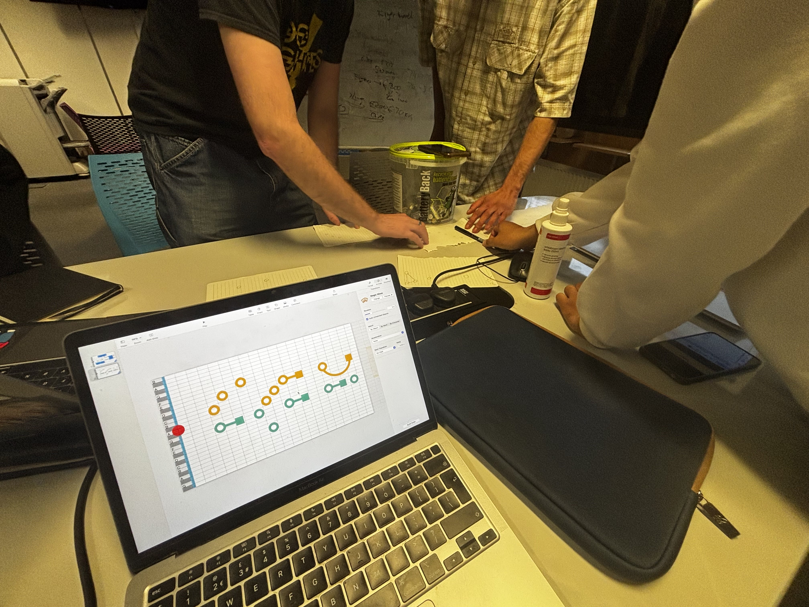
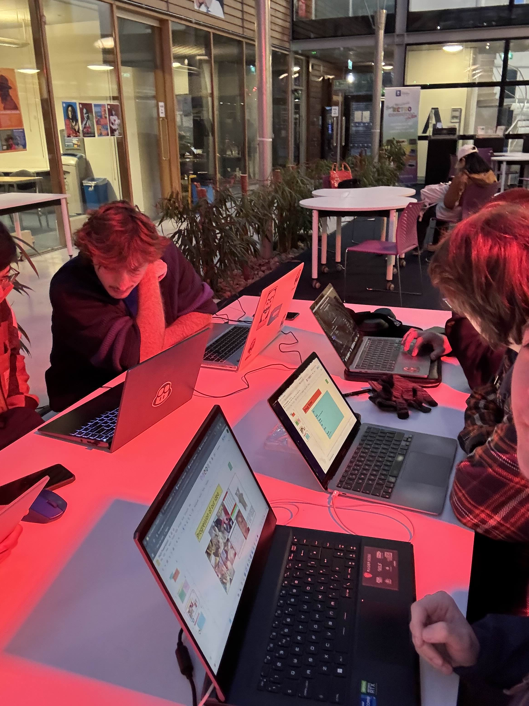

# Melodify — An Emotive Musical Decision Tree
## Project Overview
Melodify is an application designed to enhance midi instrument practice and improvisation through the
guidance of a midi-based decision tree. The project aims to transform these activities through ‘guided
improvisation’ where a player is given the opportunity and encouraged to experiment with alternative
harmonies and melodies as they perform a piece. Conceptually, the project can be described as a “choose
your own adventure”-type interface, where notes played on the input instrument influence the direction of
musical development.

Built using **Python, Pygame, and MIDI**, Melodify supports beginner to intermediate players, blending **music theory, gamification, UX principles, and immersive audio** into a dynamic experience.

### Discovery & Conceptualization
- **Problem:** Traditional music practice can be repetitive and uninspiring, causing many learners to quit.
- **Core Idea:** Create a "choose your own adventure" style guided improvisation, letting users influence the music as they play.
- **Target Users:** Beginners wanting an intuitive start and intermediate players seeking creative exploration.

---

## UX Journey

Melodify was built around **Human-Computer Interaction (HCI)** and **Flow Theory**. Some UX highlights:
Melodify is designed to provide users with the most realistic and fun experience to learn piano quickly. That
is why it receives inputs from a real keyboard, which is connected to the laptop externally, through a USB or
MIDI cable. The app supports various kinds of keyboards, ranging from large e-pianos to small MIDI pianos.

<table>
  <tr>
    <td align="center"><b>Flowchart of User Experience Journey</b></td>
  </tr>
  <tr>
    <td></td>
  </tr>
</table>

Thanks to the intuitive design of the interface, the user experience is straightforward. After plugging the
keyboard into a computer, users open Melodify app. The application automatically detects the keyboard and
connects it. If many keyboards are connected, users can select the desired one on “Setting” page by pressing
“Settings” button. To begin the learning journey, users press the “Start” button, then choose a song to learn
and press the “Play” button to start the game.

<table>
  <tr>
    <td align="center"><b> Notes falling from the top of screen</b></td>
    <td align="center"><b> Users choose either of 2 branches</b></td>
  </tr>
  <tr>
    <td>
      
    </td>
    <td>
      
    </td>
  </tr>
</table>

Once the game begins, the notes (dots) are displayed and they fall from the top down vertically. There is a
virtual keyboard layout at the bottom of the app, which represents the keys on the user’s keyboard. Whenever
users press any keys on their physical keyboards, the corresponding keys on the virtual keyboard in the app
will be shaded, giving users an intuitive experience. Therefore, users can adapt quickly and self-correct easily
when pressing the wrong keys

Sometimes the application displays 2 series of notes (2 branches) with 2 different colours, users need to choose
a path by pressing a note associated with their preferred branch. The falling notes gradually go down until
they reach the green bar, right above the virtual keyboard, which indicates the perfect time for users to press
the corresponding keys.

<table>
  <tr>
    <td align="center"><b>User hits the right key</b></td>
    <td align="center"><b>User hits the wrong key</b></td>
  </tr>
  <tr>
    <td>
      
    </td>
    <td>
      
    </td>
  </tr>
</table>

Whenever the users press the correct keys at the right time, the virtual keyboard turns green to celebrate
that success, and the score is increased. On the other hand, when they press the wrong keys, or press at the
wrong time, the virtual keyboard turns red and the health bar (life) is deducted.
During the game, users can press “P” key to pause the game. On the Pause Menu page, users can access
the game tutorial by pressing “?” key, and pressing it again to exit the tutorial.
As the players progress, the game gradually enhances the difficulty level. More notes of the song are
displayed, which makes the users play quicker, therefore, the piano sound becomes more beautiful and
complex. As the game progresses, the system plays more well-composed background music tracks. That
means the longer the players play, the more beautiful music they produce. Therefore, this mechanism makes the game sticky to the players, and the more they practice playing piano, the better they become.
When users make mistakes, such as pressing the wrong keys or pressing the correct key at the wrong time,
the health bar is deducted. The game ends when the health bar is empty, and then users go to the “Game
Over” page. On this page, users can check their rankings by clicking “Leaderboard” button, play again by
pressing the “Play Again” button or they can stop the game by choosing the “Quit” button.
After experiencing the game, we want the users to feel playing piano is not as difficult as they thought, it’s
not boring and time-consuming like what people say. They can play their favourite songs and enjoy
beautiful rhythms on the first several tries. The feeling our product brings to users is the love of playing the
piano. Therefore, they want to use Melodify to practice the skill and see it as a trusty tool to guide them in
learning piano.

## How To Play – Summary Of User Experience Flow

1. **Connect the Keyboard**: Plug your keyboard into the computer using a USB or MIDI cable.  
2. **Start the Game**: Press the **“Start”** button in the menu to begin. Choose your favourite song and press **“Play”**.  
3. **Play Notes**: Press the corresponding keys to the falling notes on the screen using your keyboard.  
4. **Timing Matters**: Press the correct keys at the right time to turn the virtual keyboard **green**.  
   - Missed notes or wrong timing will turn the virtual keyboard **red** and reduce your **health bar**.  
5. **Pause / Help**:  
   - Press **“P”** to pause the game.  
   - Press **“?”** to access this tutorial during gameplay.  
6. **Choose a Path**: When two branches of notes with different colours appear, choose a path by pressing a note in your preferred branch.  
7. **Game Over**:  
   - The game ends when your **health bar** is empty.  
   - You can choose to **play again** or **quit**.

## User Scenarios

**Emma** loved to play the piano but never got to a point of being good enough to create her own music.  
Then she came across **Melodify** software that promised she could play all the songs that she wanted, while the AI made her change the music in ways she wanted. As such, she had to try it out and see what it could offer her — such a promise!

When the music begins, she sees two options which are different in color: **blue** and **yellow**.  
She wanted to know what kind of impact her decision would have and hence she selected the blue one. She notices this affected the song in a way that made the melody softer and more gentle.

In the middle of the song, she is also presented with an option to choose between **orange** and **blue**. Out of sheer interest to see what impact orange would have on the song, she selected it.  
This transformed the song into a more energetic and fast-paced one, and she loved how this altered the story of the song. Therefore, she continued picking the branches which were coloured **red** or **orange**.

---

A **college student**, **Jonny** wants to use our platform to enhance his **timing and rhythm skills**.  
He decides to pick the song *“Jingle Bells”*, and it can be seen that there is a **score** and a **health bar**, which resets depending on the player’s timing and accuracy.

The first time he tried it, he was not very good at keeping time and having good accuracy, and he did not even get to the end of the song before he lost. He felt quite annoyed and then had a go at it again to see if he could finish the song.

After some time, he was able to complete the song. He felt proud but saw a low score in his achievement. This made him continue training to work on his **accuracy** and **timing**.  
Though the practice sessions were quite fascinating, he had to work hard to get a **perfect score**.

## design process
Iterative Development and User Feedback: The design process involved group meetings and user feedback. For example, early confusion with branches was addressed by adding colors to represent emotions, which helped users understand the concept better and enhanced their emotional connection with the music. Audio layering was also used to enhance feelings and aid users in timing. 

<table>
  <tr>
    <td align="center"><b>Initial Idea and wizard of oz approach</b></td>
    <td align="center"><b>Frequent team meetings to discuss results from user studies, and new ideas</b></td>
  </tr>
  <tr>
    <td>
      
    </td>
    <td>
      
    </td>
  </tr>
</table>

### Design & Prototyping
- **Low-Fidelity Prototypes:** Used a "Wizard of Oz" approach to simulate branching paths before full development.
- **User Flow Mapping:** Created detailed flowcharts to visualize every interaction for smooth navigation.
- **Wireframes & UI Mockups:** Designed an intuitive interface including a piano-roll, virtual keyboard, and clear controls.

### Usability Testing & Iteration
- Conducted informal and formal usability tests to identify pain points and validate designs.
- **Key Improvements Based on Feedback:**
  - **Color-coded Branches:** Used distinct colors for branching paths to reduce confusion and enhance exploration (Gestalt principle).
  - **Mood-based Colors:** Applied color psychology (blue = calm, orange = energetic) to deepen emotional connection.
  - **Real-time Feedback:** Virtual keyboard turns green for correct notes and red for mistakes, paired with subtle audio cues to support learning and engagement.
  - **Gamification:** Added score and health bar to motivate users and balance challenge with skill (Flow Theory).
  - **Audio Layering & Timing:** Enhanced rhythmic guidance with layered sounds and a metronome feature.

### Technical Implementation & Refinement
- **Modular Code Structure:** Organized code into focused files for easy maintenance and teamwork.
- **State Machine:** Used clear game states (HOME, PLAYING, GAME_OVER) to manage logic and UI separately.
- **MIDI Integration:** Leveraged `pygame.midi` for real-time keyboard input and responsive play.
- **Adaptive Music:** Created 14 musical variations based on a core chord progression to dynamically adapt to user choices.

<table>
  <tr>
    <td align="center"><b>Prototype 4</b></td>
    <td align="center"><b>prototype 8</b></td>
  </tr>
  <tr>
    <td>
      
    </td>
    <td>
      
    </td>
  </tr>
</table>

---

